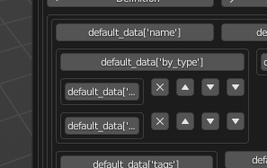

# Class variables editor UI

## Description
This module provides UI for editing class variables through blender UI, as alternative to properties.
Its pretty useless with dicts and lists of generic types though, because there is currntly no option to choose new element type.

kinda works:
    bool
    int
    float
    str

WIP, but kinda works:
    dict
    list

## How to use
Subclass `class_variables_editor_ui.panel.UIClassVariablesEditor` and use method `draw_var_editor`

## Installation
Linux:
```
git clone https://github.com/0djent/class_variables_editor_ui.git
cd class_variables_editor_ui
mkdir -p ~/.config/blender/3.1/scripts/modules
cp -r src ~/.config/blender/3.1/scripts/modules/class_variables_editor_ui
```
Or use `setup-linux.sh`.
Or install through `pip` for blender's python.

Windows:
idk

Mac:
idk
